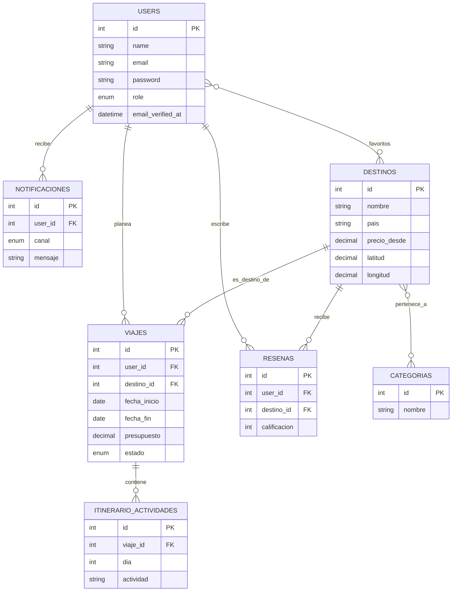

# PlanGo

Sistema web para planear viajes: elegir destino, generar un itinerario
día por día asistido por IA, y dar seguimiento al presupuesto y estado
de cada viaje, todo en un solo lugar.

## Integrantes
- Martinez Lopez Eduardo Manuel
- Cruz Alonso Kelly Adanari

## Problemática
Planear un viaje suele implicar usar varias herramientas sueltas (notas,
hojas de cálculo, chats, distintas apps de reservas) para decidir
destino, armar el itinerario y controlar el presupuesto. PlanGo
centraliza todo el proceso en un solo sistema.

## Tecnologías utilizadas
- **Backend:** Laravel 12, Laravel Sanctum, MySQL
- **Frontend:** React 18 + Vite, React Router, Axios, Leaflet
- **Integraciones:** Gemini AI (itinerarios), Twilio (SMS/WhatsApp),
  Postfix (correo real), Stripe (pago, modo de prueba)
- **Infraestructura:** VPS con Nginx (proxy reverso), Let's Encrypt/Certbot
- **Pruebas de API:** Bruno
- **Control de versiones:** GitHub + GitHub Projects
- **Diseño:** Figma

## Diagrama Entidad-Relación

## Roles de usuario
- **Viajero** — gestiona sus propios viajes e itinerarios
- **Agente de viajes** — gestiona el catálogo de destinos y categorías
- **Administrador** — acceso total, gestión de usuarios y estadísticas

## Instalación local

Ver `backend/INSTRUCCIONES-BACKEND.md` y `frontend/INSTRUCCIONES-FRONTEND.md`.

## Credenciales de prueba

| Rol | Correo | Contraseña |
|---|---|---|
| Administrador | admin@plango.test | Admin#2026 |
| Agente de viajes | agente@plango.test | Agente#2026 |
| Viajero (developer) | developer@plango.test | Developer#2026 |

## URLs

- Proyecto desplegado:https://plango.duckdns.org 
- URL base de la API: _(pegar aquí, ej. https://tudominio.com/api)_

## Enlaces del proyecto

- Tablero de GitHub Projects: _(pegar aquí)_
- Prototipo de Figma: https://www.figma.com/design/1DDqPMfTnYtLCJvv2ltPrh/7.--Act7.-Mockup-en-Figma-del-Sistema?node-id=0-1&t=QuANunCsSzLvNDXd-0

## Pruebas con Bruno

La colección está en la carpeta `/bruno` en la raíz de este repositorio.
Incluye: login y obtención de token, uso del token en una ruta protegida,
y casos de error a propósito (sin token, sin permiso de rol).
