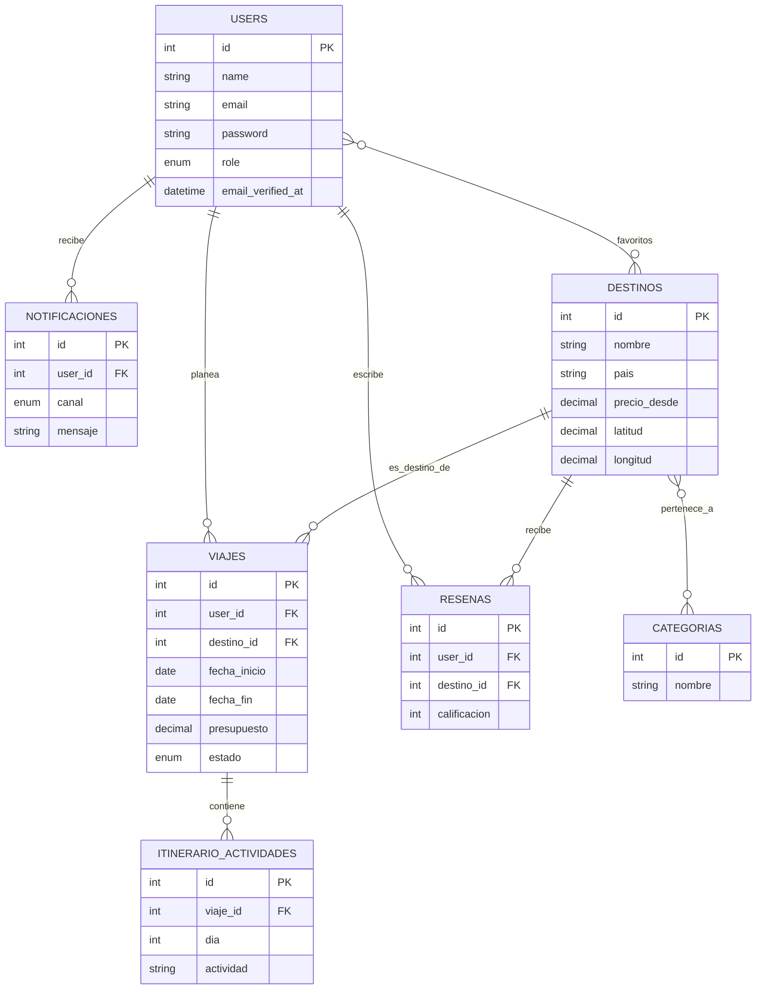

# PlanGo

Sistema web para planear viajes: elegir destino, generar un itinerario
día por día asistido por IA, y dar seguimiento al presupuesto y estado
de cada viaje, todo en un solo lugar.

## Integrantes
- Martinez Lopez Eduardo Manuel
- Cruz Alonso Kelly Adanari

## Problemática
Planear un viaje suele implicar usar varias herramientas sueltas (notas,
hojas de cálculo, chats, distintas apps de reservas) para decidir
destino, armar el itinerario y controlar el presupuesto. PlanGo
centraliza todo el proceso en un solo sistema.

## Tecnologías utilizadas
- **Backend:** Laravel 12, Laravel Sanctum, MySQL
- **Frontend:** React 18 + Vite, React Router, Axios, Leaflet
- **Integraciones:** Gemini AI (itinerarios), Twilio (SMS/WhatsApp),
  Postfix (correo real), Stripe (pago, modo de prueba)
- **Infraestructura:** VPS con Nginx (proxy reverso), Let's Encrypt/Certbot
- **Pruebas de API:** Bruno
- **Control de versiones:** GitHub + GitHub Projects
- **Diseño:** Figma

## Diagrama Entidad-Relación



## Roles de usuario
- **Viajero** — gestiona sus propios viajes e itinerarios
- **Agente de viajes** — gestiona el catálogo de destinos y categorías
- **Administrador** — acceso total, gestión de usuarios y estadísticas

## Instalación local
 
### Backend (Laravel)
 
1. Entra a la carpeta `backend` e instala las dependencias:
```bash
   composer install
```
2. Copia `.env.example` a `.env` y configura tu base de datos MySQL:
```
   DB_DATABASE=plango_db
   DB_USERNAME=root
   DB_PASSWORD=tu_contraseña
```
3. Genera la clave de la aplicación y corre migraciones + seeders:
```bash
   php artisan key:generate
   php artisan migrate:fresh --seed
```
4. Levanta el servidor:
```bash
   php artisan serve
```
   Prueba abriendo `http://127.0.0.1:8000/api/destinos` — si ves un JSON
   con destinos de viaje, el backend está funcionando.

### Frontend (React + Vite)
 
1. Entra a la carpeta `frontend` e instala las dependencias:
```bash
   npm install
```
2. Confirma en tu `.env` que apunte al backend local:
```
   VITE_API_URL=http://127.0.0.1:8000/api
```
3. Levanta el proyecto:
```bash
   npm run dev
```
4. Abre la URL que te dé (normalmente `http://localhost:5173`) e inicia
   sesión con el usuario developer (`developer@plango.test` /
   `Developer#2026`) para confirmar que el frontend y el backend estén
   hablando entre sí correctamente.


## Credenciales de prueba

| Rol | Correo | Contraseña |
|---|---|---|
| Administrador | admin@plango.test | Admin#2026 |
| Agente de viajes | agente@plango.test | Agente#2026 |
| Viajero (developer) | developer@plango.test | Developer#2026 |

## URLs

- Proyecto desplegado: https://plango.duckdns.org/ 
- URL base de la API: https://plango.duckdns.org/api

## Enlaces del proyecto

- Tablero de GitHub Projects: https://github.com/users/EduardoManuelMartinezLopez/projects/1
- Prototipo de Figma: https://www.figma.com/proto/1DDqPMfTnYtLCJvv2ltPrh/7.--Act7.-Mockup-en-Figma-del-Sistema?node-id=112-112&p=f&t=d9J7VX7PEfuO7YPu-0&scaling=min-zoom&content-scaling=fixed&page-id=0%3A1&starting-point-node-id=112%3A376&show-proto-sidebar=1
## Pruebas con Bruno

La colección está en la carpeta `/bruno` en la raíz de este repositorio.
Incluye: login y obtención de token, uso del token en una ruta protegida,
y casos de error a propósito (sin token, sin permiso de rol).
